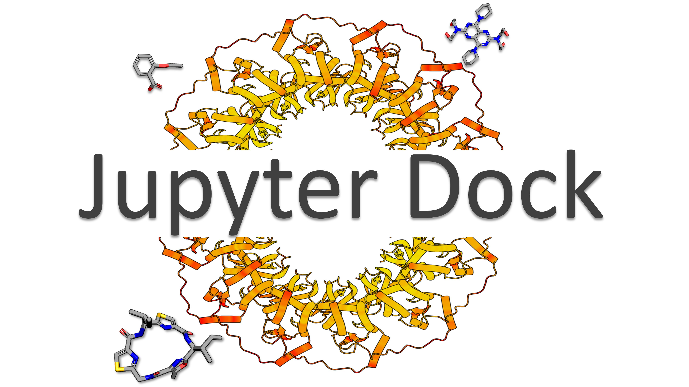

# **Molecular Docking integrated in Jupyter Notebooks**

[](https://zenodo.org/badge/latestdoi/405159870)

[**Description**](#description) | [**Citation**](#citation) | [**Installation**](#installation) | [**Examples**](#examples) | [**Limitations**](#limitations) | [**License**](#license)



## Table of content

- [**Description**](#description)

- [**Installation**](#installation)

- [**Requirements**](#requirements)

- [**Limitations**](#limitations)

- [**Examples**](#examples)

- [**Citation**](#citation)

- [**License**](#license) 


## Description

**Jupyter Dock is a set of Jupyter Notebooks for performing molecular docking protocols interactively, as well as visualizing, converting file formats and analyzing the results.** <br><br>

**See Jupyter Docks in action in my personal website: [chem-workflows](https://chem-workflows.com/)** <br><br>

These notebooks are Python 3 compatible. Each protocol and Jupyter notebook has its own test folder for testing and reproducibility evaluation.

For all notebooks, the demonstration includes the use of AutoDock Vina and Ledock. When available, some alternatives are mentioned in the protocol.

The notebooks includes whole protocols for:

**1. Molecular Docking**
> For any new user, this is a good place to start. Jupyter Docks' main stages for molecular docking, as well as all functions, methods and codes are described here along with brief explanations, hints, and warnings.

**2. Virtual Screening**
> Interested in docking multiple ligands into a single target site? This is what you require. This protocol covers all steps from ligand preparation to docking pose visualization in the target site of interest.

**3. Blind Docking**
> Do you want to dock multiple ligands into whole target surface and/or its pockets? This protocol demonstrates the entire process of pocket search and their use as potential organic molecule binding sites.

**4. Reverse Docking / Target fishing)**
> Interested in docking one or a few molecules into a set of proteins to identify the most promising target(s)? This notebook covers all of the steps required to achieve such a goal in a condensed manner, making the process seem like a walk in the park.

**5. Docking Analysis**
> Have you completed your docking experiments with Jupyter Dock or another approach and want to conduct a rational analysis? You've come to the right place. This notebook summarizes the most common docking analysis techniques, including score comparisons, z-score calculation between softwares, pose clustering, molecular interactions mapping, and more.


Question about usage or troubleshooting? Please leave a comment here

## Installation 

- **Available as GitHub repo:**

```
$git clone https://github.com/AngelRuizMoreno/Jupyter_Dock.git
$cd Jupyter_Dock
$conda env create -f Jupyter_Dock.yml
```

After installing the prerequisites, you can activate the conda environment and run/modify the Jupyter Notebooks.


- **GoogleColab:**

```
Not yet available.
```

## Requirements

Jupyter Dock is reliant on a variety of academic software. The Jupyter Dock.yaml file contains all the tools and dependencies, but the following are some of the most noticeable:

- [Autodock Vina](https://autodock-vina.readthedocs.io/en/latest/) 
- [AutoDock Tools](http://autodock.scripps.edu/resources/adt)
- [Ledock and Lepro](http://www.lephar.com/software.htm)
- [Pymol API](https://pymol.org/2/)
- [OpenBabel](http://openbabel.org/wiki/Main_Page)
- [RDKit](https://www.rdkit.org/)
- [py3Dmol](https://3dmol.csb.pitt.edu/) 
- [PDBFixer](https://htmlpreview.github.io/?https://github.com/openmm/pdbfixer/blob/master/Manual.html)
- [MDAnalysis](https://www.mdanalysis.org/)
- [ProLif](https://prolif.readthedocs.io/en/latest/index.html)
- [Fpocket](http://fpocket.sourceforge.net/)
- [Meeko](https://pypi.org/project/meeko/)
- [Smina](https://sourceforge.net/projects/smina/)

## Limitations

## Examples

## Citation

If you use these notebooks, please credit this repository and the required tools as follows:

1. **Jupyter Dock**
    > Ruiz-Moreno A.J. Jupyter Dock: Molecular Docking integrated in Jupyter Notebooks. https://doi.org/10.5281/zenodo.5514956

1. **Autodock Vina** 
    > Eberhardt, J., Santos-Martins, D., Tillack, A.F., Forli, S. (2021). AutoDock Vina 1.2.0: New Docking Methods, Expanded Force Field, and Python Bindings. Journal of Chemical Information and Modeling.

    > Trott, O., & Olson, A. J. (2010). AutoDock Vina: improving the speed and accuracy of docking with a new scoring function, efficient optimization, and multithreading. Journal of computational chemistry, 31(2), 455-461.

1. **LeDock** 
    > Wang Z, Sun H, Yao X, Li D, Xu L, Li Y, et al. Comprehensive evaluation of ten docking programs on a diverse set of protein–ligand complexes: the prediction accuracy of sampling power and scoring power. Phys Chem Chem Phys. 2016;18: 12964–12975. https://doi.org/10.1039/C6CP01555G.
 
1. **AutoDock Tools**
    > Morris, G. M., Huey, R., Lindstrom, W., Sanner, M. F., Belew, R. K., Goodsell, D. S., & Olson, A. J. (2009). AutoDock4 and AutoDockTools4: Automated docking with selective receptor flexibility. Journal of computational chemistry, 30(16), 2785–2791. https://doi.org/10.1002/jcc.21256.

1. **Pymol API**
    > The PyMOL Molecular Graphics System, Version 1.2r3pre, Schrödinger, LLC.
    
1. **OpenBabel**
    > O'Boyle, N.M., Banck, M., James, C.A. et al. Open Babel: An open chemical toolbox. J Cheminform 3, 33 (2011). https://doi.org/10.1186/1758-2946-3-33.

1. **RDKit**
    > RDKit: Open-source cheminformatics; http://www.rdkit.org

1. **py3Dmol**
    >Keshavan Seshadri, Peng Liu, and David Ryan Koes. Journal of Chemical Education 2020 97 (10), 3872-3876. https://doi.org/10.1021/acs.jchemed.0c00579.
    
1. **PDBFixer**
    > P. Eastman, M. S. Friedrichs, J. D. Chodera, R. J. Radmer, C. M. Bruns, J. P. Ku, K. A. Beauchamp, T. J. Lane, L.-P. Wang, D. Shukla, T. Tye, M. Houston, T. Stich, C. Klein, M. R. Shirts, and V. S. Pande. 2013. OpenMM 4: A Reusable, Extensible, Hardware Independent Library for High Performance Molecular Simulation. Journal of Chemical Theory and Computation. ACS Publications. 9(1): 461-469.

1. **MDAnalysis**
    > R. J. Gowers, M. Linke, J. Barnoud, T. J. E. Reddy, M. N. Melo, S. L. Seyler, D. L. Dotson, J. Domanski, S. Buchoux, I. M. Kenney, and O. Beckstein. MDAnalysis: A Python package for the rapid analysis of molecular dynamics simulations. In S. Benthall and S. Rostrup, editors, Proceedings of the 15th Python in Science Conference, pages 98-105, Austin, TX, 2016. SciPy, doi:10.25080/majora-629e541a-00e.
    
    > N. Michaud-Agrawal, E. J. Denning, T. B. Woolf, and O. Beckstein. MDAnalysis: A Toolkit for the Analysis of Molecular Dynamics Simulations. J. Comput. Chem. 32 (2011), 2319-2327, doi:10.1002/jcc.21787. PMCID:PMC3144279.

1. **ProLif**
    > chemosim-lab/ProLIF: v0.3.3 - 2021-06-11.https://doi.org/10.5281/zenodo.4386984.
    
1. **Fpocket**
    >Le Guilloux, V., Schmidtke, P. & Tuffery, P. Fpocket: An open source platform for ligand pocket detection. BMC Bioinformatics 10, 168 (2009). https://doi.org/10.1186/1471-2105-10-168.

1. **Smina**
    > Koes, D. R., Baumgartner, M. P., & Camacho, C. J. (2013). Lessons learned in empirical scoring with smina from the CSAR 2011 benchmarking exercise. Journal of chemical information and modeling, 53(8), 1893–1904. https://doi.org/10.1021/ci300604z

## License
These notebooks are under MIT, see the LICENSE file for details.
